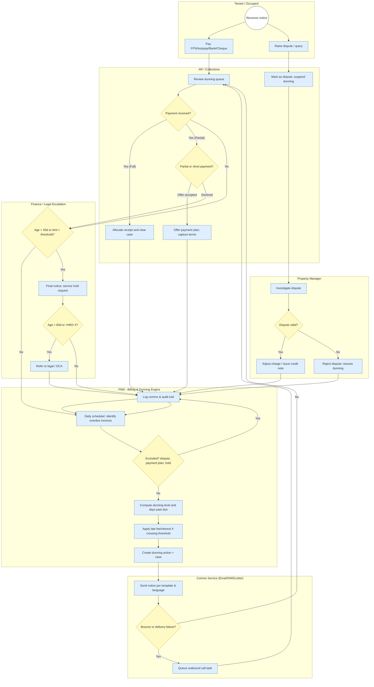

## To‑Be Late Payment Reminder Workflow (HK Property Management)

This proposal defines a configurable late payment reminder (dunning) workflow aligned to Hong Kong property management practices, with clear swimlanes and escalation thresholds.

### Scope and assumptions
- Residential/commercial tenancies with monthly recurring charges and ad‑hoc charges
- Supported payments: FPS, bank transfer/Autopay, cheque, card (optional)
- Dunning is per‑account with invoice‑level detail; disputes and payment plans pause dunning
- Bilingual communications (EN/ZH) with PDPO‑compliant consent and audit trail

### Roles (swimlanes)
- Tenant / Occupant
- PMS – Billing & Dunning Engine
- Comms Service – Email/SMS/Letter generation and delivery
- AR / Collections
- Property Manager
- Finance / Legal Escalation

### Swimlane diagram

### Suggested dunning ladder (parameterised)
- D+3: Courtesy reminder via Email/SMS; no fee
- D+7: First overdue Email + SMS; show amount due and payment links
- D+14: Second overdue Email + Letter; apply late fee/interest if enabled
- D+21: Phone call task; warn of potential service hold (as contractually permitted)
- D+30: Final notice; initiate service hold request (e.g., access cards, facility booking) per policy
- D+45: Demand letter; manager approval required
- D+60: Legal/DCA referral; case file compiled automatically

Parameters per property/portfolio: thresholds (HKD), fee rate/minimum, holidays calendar, bilingual templates, and excluded accounts (government, VIP, active payment plans, active disputes).

### Controls, compliance and audit
- PDPO: consent records, unsubscribe handling, purpose limitation; mask PII in reports
- Role‑based approvals for fee application, service hold and legal referral
- Immutable audit log of reminders, calls, letters, fee postings and reversals
- SLA timers for dispute handling; dunning auto‑pauses while in dispute or payment plan

### Key system behaviours
- Auto‑allocation on FPS/Autopay receipts; partials trigger plan offer logic
- Multi‑channel templates with EN/ZH variants and property headers
- Bounced communication detection routes to outbound call queue
- Manager dashboard: ageing buckets, promise‑to‑pay tracking, exception list

### KPIs
- Collection rate by bucket (0‑30/31‑60/61‑90/90+)
- Days Sales Outstanding (DSO)
- Promise‑to‑pay kept ratio; right‑party contact rate; bounce rate
- Dispute cycle time; fee reversal rate
